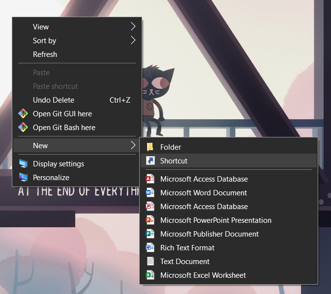
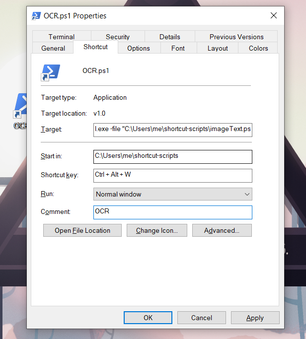

# shortcut-scripts

This is a collection of scripts I have on my Windows 10 laptop (also works on Windows 11).
Each Powershell script can be triggered by a keyboard shortcut.

---

Run `git clone https://github.com/mr4tt/shortcut-scripts` to download the scripts.

## To set up a keyboard shortcut trigger

1. Go to your Desktop and right click
2. Select `New` -> `Shortcut`
   
3. Browse for the location of your Powershell script (presumably in this repo you've cloned)
4. Name the shortcut
5. Right click the shortcut and select `Properties`
6. Open the `Shortcut` tab
7. Change the `Target` to tell Powershell to execute the script.
   - For me, this is `C:\Windows\System32\WindowsPowerShell\v1.0\powershell.exe -file "C:\Users\me\shortcut-scripts\[script-name.ps1]"`
8. Change the `Shortcut Key` to be whatever keyboard shortcut you'd like to use to trigger the script to run
9. Click `Apply`, then `OK`
   

## To set up wordCount script

This script counts the number of lines, characters, and words of a piece of text in your clipboard.

1. Create a shortcut
2. Point the Target to the location of `wordCount.ps1`

## To set up imageText script

This script transcribes text from an image in your clipboard, then puts the text in your clipboard.

If you want to keep the image and text both in your clipboard, I recommend turning on Clipboard History. To get started, press `Windows + V`.

Note that you will need Python installed, as this Powershell script just starts a virtual environment (extra info below), runs the Python script for the actual OCR (Optical Character Recognition), and then puts the text in the terminal and in your clipboard.

1. Create a virtual environment and activate it
   - `python -m venv env`
   - `source env/Scripts/activate`
2. Install required packages
   - `pip install -r requirements.txt`
3. Install the Tesseract executable (this does the actual OCR)
   - Download the installer from https://github.com/UB-Mannheim/tesseract/wiki
   - Run the installer and download the files somewhere
   - Note the path to the `tesseract.exe` file
4. Create a file with the location of `tesseract.exe`
   - Create a file called `.env` in this folder
   - Paste `tesseract_exe=[path to tesseract.exe]` inside the file
     - This tells the program how to reference the Tesseract program
5. Create a shortcut
6. Point the Target to the location of `imageText.ps1`

What's a virtual environment?

 

A virtual environment is a folder you create that stores a copy of Python and any packages you install for the project. Thus, when we run a `pip install [package]`, pip will look in the `requirements.txt` to see which version of a package to use and installs it in the virtual environment. If this gets installed globally (not in the virtual environment), it might interfere with other package versions you have already installed.

